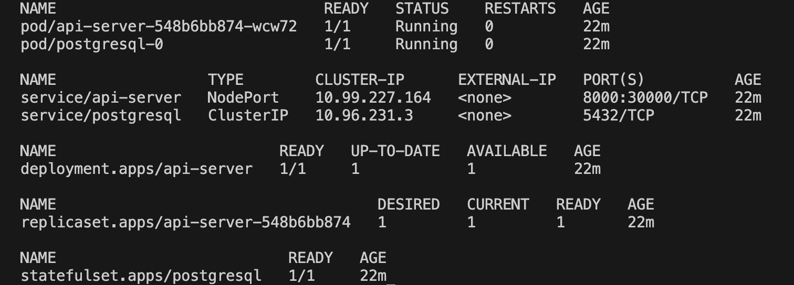

# Infrastructure Setup Project

## 프로젝트 개요
Kubernetes(minikube) 환경에서 Health Check, CRUD API 서버와 Database를 구축하는 프로젝트입니다.
Terraform을 통한 인프라 관리 및 Helm chart를 통한 애플리케이션 배포를 구현했습니다.

## 아키텍처 구상도 및 폴더 구조
- TODO

```
INFRA/
├── helm/
│   ├── api-server/
│   │   ├── templates/
│   │   │   ├── deployment.yaml
│   │   │   └── service.yaml
│   │   ├── Chart.yaml
│   │   └── values.yaml
│   └── postgresql/
│       ├── templates/
│       │   ├── statefulset.yaml 
│       │   └── service.yaml
│       ├── Chart.yaml
│       └── values.yaml
├── images/
│   └── ...
├── manual_test/
│   ├── test-api.yml
│   └── test-db.yml
└── terraform/
   ├── .terraform/
   ├── main.tf
   ├── providers.tf
   ├── variables.tf
   ├── terraform.tfvars
   ├── .terraform.lock.hcl
   ├── terraform.tfstate
   ├── terraform.tfstate.backup
   └── .gitignore
```

### 폴더 구조 구성 근거
(Terraform 표준 폴더 구조)[https://developer.hashicorp.com/terraform/language/modules/develop/structure]

(Helm Chart 작성 가이드)[https://helm.sh/docs/topics/charts/]

## 기술 스택
- **Terraform v1.5.7**
- **Docker v24.0.6**
- **Minikube v1.31.0**
- **Helm v3.16.3**
- **PostgreSQL (Bitnami Helm Chart)**

API 서버 구현 간 사용한 기술 스택 및 선정 근거는 [API Server Repository](https://github.com/sejoonkimmm/API-Repository) 링크를 통해 확인하실 수 있습니다.

## 구축 과정
1. [Minikube 설정](docs/minikube-setup.md)

2. [Helm, Terraform 구성 전 수동 테스트](docs/manual-test.md)

3. [Terraform 구성](docs/terraform-setup.md)

4. [Helm Chart 구성](docs/helm-setup.md)

### 구성 근거
#### Minikube 사용 근거
- 로컬 개발 환경에서의 쿠버네티스 클러스터 검증
- 비용 효율적인 테스트 환경

#### 수동 테스트 진행 근거
- 각 컴포넌트의 독립적 검증
- Helm Chart 작성을 위한 기초 자료 수집
- 문제 발생 시 빠른 디버깅

## 구축 완료 보고
- ✅ Minikube Cluster 구성
- ✅ PostgreSQL StatefulSet 배포
- ✅ CRUD API Server 배포
- ✅ Helm chart 구성
- ✅ Terraform 인프라 관리

### 기능 구현 완료
- ✅ Health Check 엔드 포인트
- ✅ DB CRUD 기능
- ✅ Helm Chart 패키징

### 구축 예정 기능 (Not mandatory / Optional)
- ✅ Healthcheck 기능 강화 (Kubernetes 환경 정보 및 DB상태, 지연 시간 측정, 상세한 로그 제공)
- ✅ DB 고가용성 정책 도입 (Streaing Replication)
- [ ] TODO(CRUD) API 서버 기능 강화 및 예외처리
- [ ] Prometheus, Grafana를 통한 모니터링
- [ ] ArgoCD를 통해 API Server의 Repository에 변경 발생 시 무중단 배포

### 구축 결과
1. kubectl get all -n my-app 결과


2. Health Check 결과

