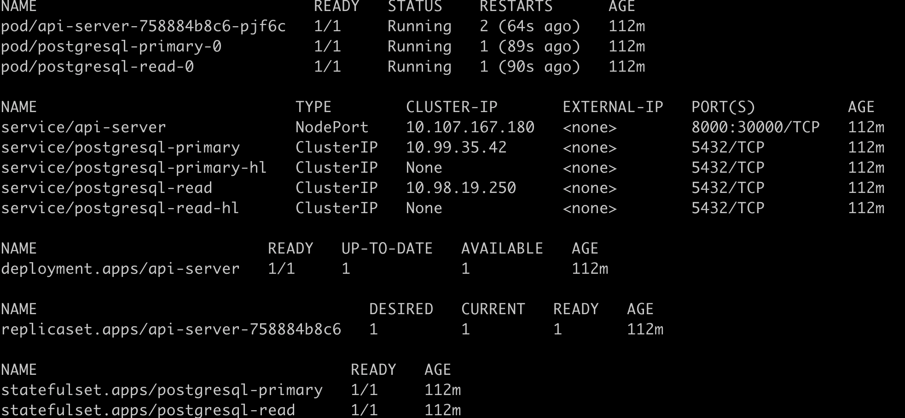
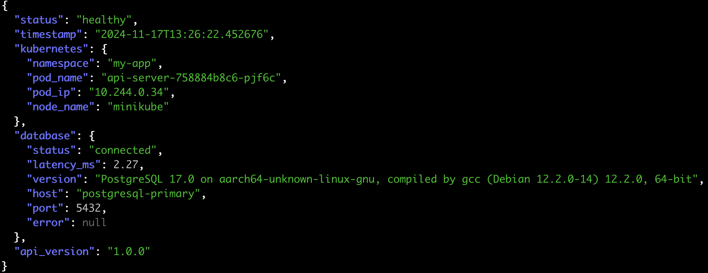
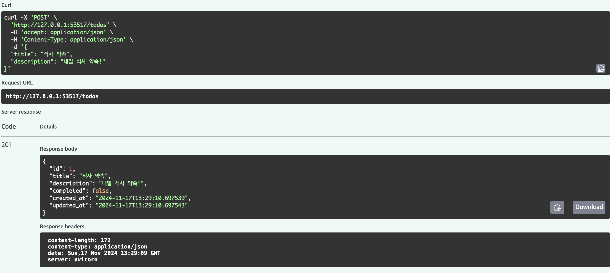
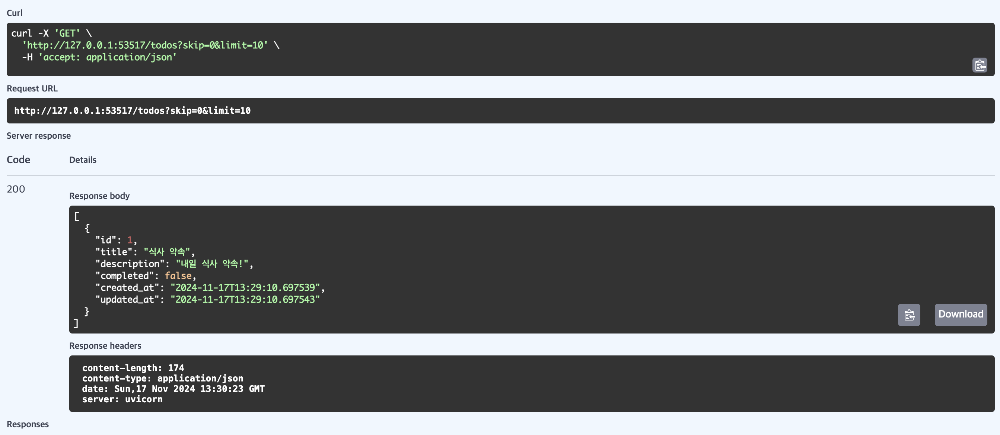
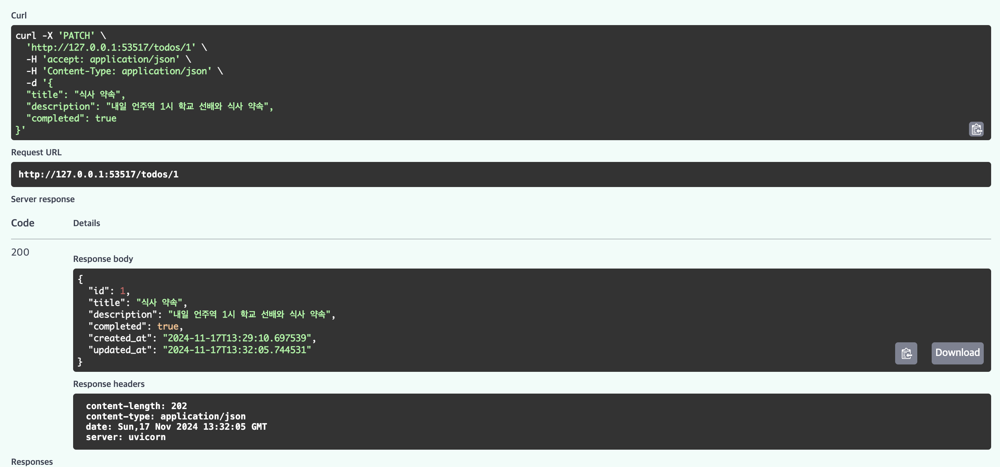
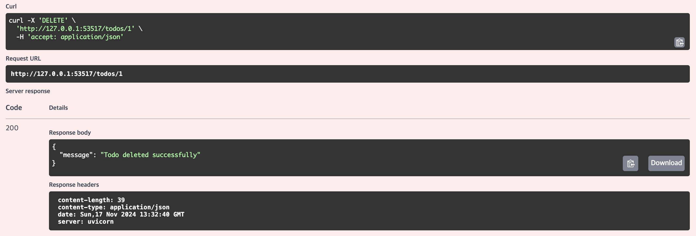

# Infrastructure Setup Project

## Project Overview
### Purpose
1. Build HealthCheck and CRUD API server in Kubernetes(minikube) environment
2. Deploy and integrate Database
3. Automate infrastructure using Terraform
4. Deploy applications using Helm Chart configuration

### Tech Stacks
- **Terraform v1.5.7**
- **Docker v24.0.6**
- **Minikube v1.31.0**
- **Helm v3.16.3**
- **PostgreSQL (Bitnami Helm Chart)**

For the technology stack and selection rationale used in API server implementation, please refer to the API Server Repository link.

[API Server Repository](https://github.com/sejoonkimmm/API-Repository)


## Architecture Design and Directory Structure
### Overall Architecture


### Directory Structure
```
INFRA/
├── helm/
│   ├── api-server/
│   │   ├── templates/
│   │   │   ├── deployment.yaml
│   │   │   └── service.yaml
│   │   ├── Chart.yaml
│   │   └── values.yaml
├── images/
│   └── ...
├── manual_test/
│   ├── test-api.yml
│   └── test-db.yml
└── terraform/
   ├── .terraform/
   ├── main.tf
   ├── providers.tf
   ├── variables.tf
   ├── terraform.tfvars
   ├── terraform.tfstate
   ├── terraform.tfstate.backup
   └── .gitignore
```

Directory Structure Rationale
(Terraform Standard Directory Structure)[https://developer.hashicorp.com/terraform/language/modules/develop/structure]

(Helm Chart Writing Guide)[https://helm.sh/docs/topics/charts/]

## Implementation Report
### Implementation Sequence
1. [Minikube Configuration](docs/minikube-setup.md)
- Kubernetes cluster verification in local development environment
- Cost-efficient testing environment

2. [Manual Testing before Helm and Terraform Configuration](docs/manual-test.md)
- Gathering baseline data for Helm Chart creation
- Independent verification of each component
- Quick debugging when issues arise

3. [Terraform Configuration](docs/terraform-setup.md)

4. [Helm Chart Configuration](docs/helm-setup.md)

### Essential Implementation Items
✅ Minikube Cluster Setup
- Stable local Kubernetes environment setup
✅ PostgreSQL StatefulSet Deployment
- Persistent storage configuration
- Data consistency assurance
- Streaming Replication setup
✅ CRUD API Server Deployment
- Health Check endpoint implementation
- CRUD API implementation
- Documentation through Swagger
✅ Infrastructure as Code
- Terraform-based infrastructure management
- Application deployment automation through Helm Chart

### Deployment Results

**Cluster Status**
```bash
kubectl get all -n my-app
```



**API Test Result**
1. Health Check Endpoint



2. Swagger API Test
   - TODO Create

   

   - TODO Read(list)

   

   - TODO Update

   

   - TODO Delete

   


## Additional Implementations
### Completed Improvements

1. Enhanced Health Check System
- Kubernetes environment information provision
- DB connection status monitoring
- Detailed latency measurement
- Comprehensive system status logging

2. Github Action CI Implementation
- Automated Code convention checks
- Automated container build and upload

3. Database High Availability
- Streaming Replication configuration


### Future Implementation Plans

1. Enhanced API Server
- Improved exception handling system
- Strengthened logging system

2. Monitoring System Implementation
- Prometheus metrics collection
- Grafana dashboard configuration

3. CD Pipeline Implementation
- Zero-downtime deployment based on ArgoCD
- Automated test integration
